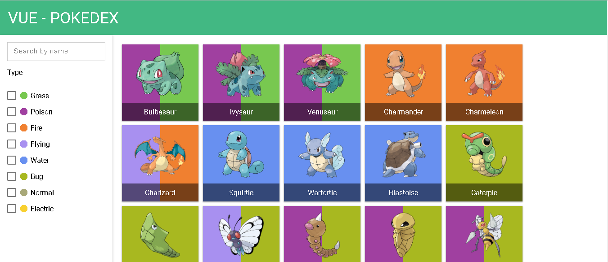

# Mundo Pokémon

_Simplemente abra index.html_

## Construido con 🛠️

_Herramientas utilizadas para crear el proyecto_

* [JS](https://vuejs.org/) - El framework Vue
* [JSON](https://www.json.org/) - El back end Json (JavaScript Object Notation) consumido con fetch
* [HTML](#) - HyperText Markup Language
* [CSS](https://www.w3.org/Style/CSS/Overview.en.html) - Cascading Style Sheets

## Credits
Nice input from @Takumari85: https://codepen.io/Takumari85/pen/RaYwpJ

Nice checkbox from [@hansmaad](https://twitter.com/hansmaad): https://codepen.io/hansmaad/pen/qaGrQL

---
⌨️ con ❤️ por [Jsalas](https://github.com/Jsalas902) 😊